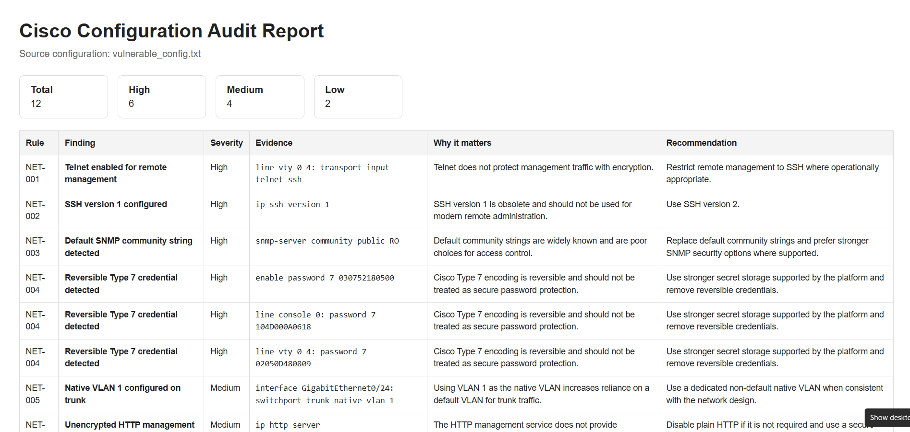

# Cisco Config Auditor

Cisco Config Auditor is a small Python tool that reviews Cisco IOS-style `running-config` text files and creates an HTML report for common security and hardening issues.

I wanted a simple way to review Cisco configurations for common mistakes instead of checking each setting manually.

## What it checks

The current version includes eight checks:

1. Telnet enabled on VTY lines
2. SSH version 2 not explicitly configured
3. Default SNMP community strings such as `public` or `private`
4. Reversible Cisco Type 7 credentials
5. Default/native VLAN 1 behavior on trunk ports
6. Plain HTTP management service enabled
7. VTY lines without an inbound `access-class`
8. Access ports without port-security configuration

Each finding includes:

- Severity
- Configuration evidence
- Short explanation
- Recommended remediation

## Project structure

```text
cisco-config-auditor/
├── audit.py
├── auditor/
│   ├── __init__.py
│   ├── parser.py
│   ├── report.py
│   └── rules.py
├── samples/
│   ├── hardened_config.txt
│   └── vulnerable_config.txt
└── tests/
    └── test_rules.py
```

## How it works

```text
running-config.txt
        |
        v
  lightweight parser
        |
        v
   security checks
        |
        v
     findings
        |
        v
   HTML audit report
```

The parser separates global commands, interface sections, and `line` sections. The rule engine then checks the relevant parts of the configuration and sends any findings to the HTML report generator.

## Run it

Python 3.10+ is recommended.

```bash
python audit.py samples/vulnerable_config.txt
```

To choose a report name:

```bash
python audit.py samples/vulnerable_config.txt -o vulnerable-report.html
```

## Run the tests

From the project root:

```bash
python -m unittest discover -s tests
```

## Example output

Below is an example report generated from the included vulnerable Cisco configuration.



For the included vulnerable sample, the tool should identify issues such as:

- Telnet enabled
- SSH version 1
- SNMP `public`
- Type 7 credentials
- Native VLAN 1 on a trunk
- HTTP management enabled
- Missing VTY source restriction
- Missing port-security on access ports

## Scope and limitations

This is intentionally a small portfolio project, not a commercial compliance scanner.

- It does not claim full CIS or STIG compliance.
- It does not connect to live network devices.
- It does not change device configuration.
- It supports a limited set of common Cisco IOS-style patterns.
- Some recommendations depend on the actual network design and operational requirements.

## Possible next steps

- Add JSON output
- Add more configuration rules
- Improve parser coverage
- Add a small web interface
